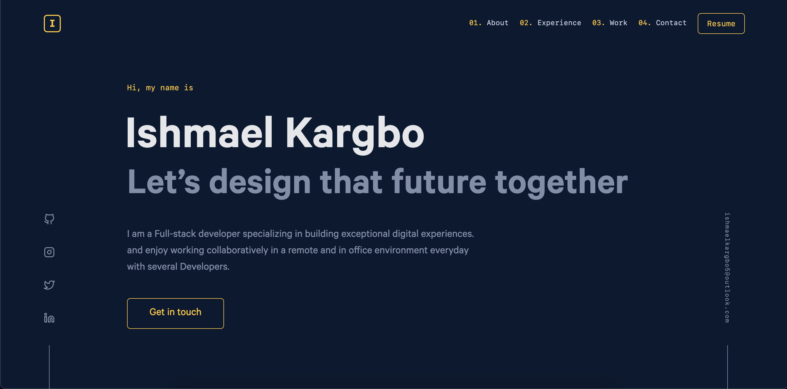

# My Portfolio

My portfolio website to show case my prefection to the world

#### App Screenshot

### Live Demo
<!-- <a href="https://ishmaelkargbo.github.io/my-portfolio">Todo App</a> -->

## Built With

- Ruby
- Rails
- React
- Tailwindcss
- Styled Components

## Getting Started

To get a local copy up and running follow these simple example steps.

- Clone this repository to your local machine
`git clone https://github.com/IshmaelKargbo/my-portfolio.git`
- Go to the project filder
`cd my-portfolio`
- Install the required bundle
`bundle install`
- Setup your database but you need to add to db username and password in the database.yml in the config folder and the run the script
`rails db:setup`
`rails db:migrate`
`rails db:seed`
- Run the app on development server
`bin/dev`

## Authors

👤 **Ishmael Kargbo**

- GitHub: [@githubhandle](https://github.com/ishmaelkargbo)
- Twitter: [@twitterhandle](https://twitter.com/ishodev)
- LinkedIn: [LinkedIn](https://www.linkedin.com/in/ishmael-kargbo-503660169)

## 🤝 Contributing

Contributions, issues, and feature requests are welcome!

Feel free to check the [issues page](https://github.com/IshmaelKargbo/my-portfolio/issues).

## Show your support

Give a ⭐️ if you like this project!
